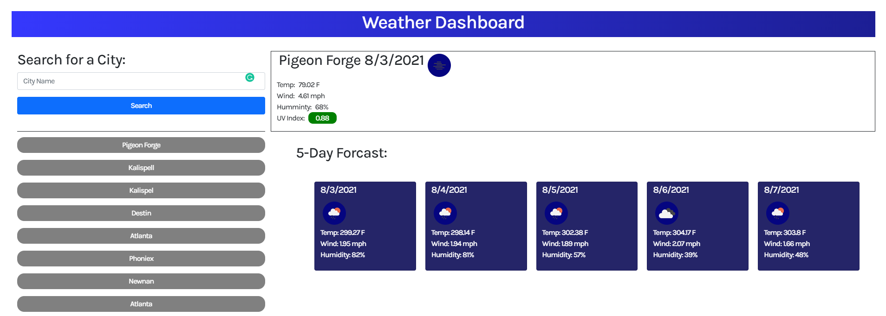

# weather dashboard

## Description

This application is designed to allow the user to search a city name
and display the current weather and a 5 day forcast. It will also store
previous searches for the user to access if they wish. The search history
is limited to ten searches. If the user enters a city incorrectly or 
something that is not a city it will alert the user that it can not find city.
Also in the current weather the color background around the UV index will 
change colors depending on the serverity. 

## Languages, and APIs

* JavaScript
* HTML
* CSS

* Bootstrap
* Jquery
* Open Weather API

## Screenshot

